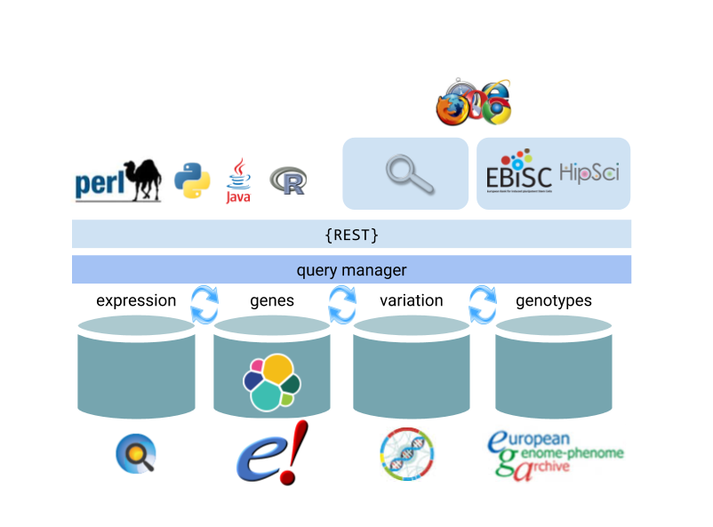

# Overview
This project is an ongoing effort to provide fast, flexible access to data from Ensembl and related . The main audience are those who want to identify and download custom sets of data for further use, but this project provides functionality that could be

The main goals are:
* scalability - Ensembl has over 40,000 genomes, and will only get bigger.
* speed - interactive GUIs and client applications need fast access
* flexibility - Ensembl has a wealth of different data which may need to be queried in a wide range of ways by a wide range of different clients
* extensibility - different data can be stored and accessed in different ways, and any application like this must provide a technology-agnostic interface

The current system architecture is shown below, and discussed further in the sections below:

# Search
The core of the system is the search subsystem. This provides a simple abstraction for searching data from a variety of different database backends, from Elastic and Mongo to REST and htsget. This layer also allows basic joining between different sources.

This subsystem can be used directly, or via the REST interface described in the next section.

For more about this system, please see [Search](./search/overview.md)

# Web
## REST API

For more about this system, please see [REST](./rest/overview.md)

## GUI
For interactive use, a Javascript GUI allows access to 

For more about this system, please see [Web](./web/README.md)
