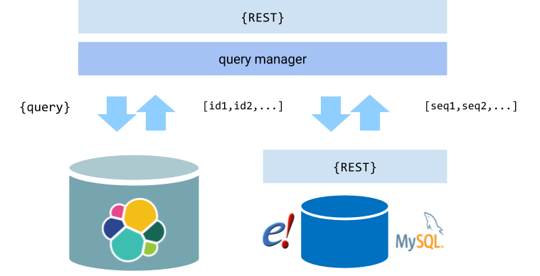

# Overview

The main `Search` abstraction is just that, so concrete implementations are needed for each different technology. 

In addition, there are specialised implementations that can combine or rework data from concrete implementations. All of this is described below.

# ElasticSearch implementation

From an Ensembl-centric standpoint, the most important implementation of `Search` is `org.ensembl.genesearch.impl.ESSearch` which uses Elasticsearch (ES) via a Java API. This supports different indices and types including gene, genome and variation data. This implementation is content-agnostic, which means that other types where biological entities can be represented by nested JSON documents can also be added fairly simply (e.g. regulation data).

The main steps used in executing a query include:
1. Create an ES `QueryBuilder` instance from the supplied `Query` object
2. Create an ES search request object using the query, fields, limits, facets etc.
3. Execute the search
4. Process the ES Response (see `processResults`) and packaged into a `QueryResult` object with aggregations etc.

Note that sorts are passed as a list of field names, but prefixing the name with `+` or `-` sets the direction to ascending or descending as appropriate. Facets and fields are passed as lists of field names as well.

For fetch methods, the approach is different:
1. Analyse the query - for large numbers of query terms (e.g. lists of IDs), the query is split into pieces and executed separately with individual calls back to fetch. This is to avoid performance problems with very large results set
2. Build a search request as above (but no support for sort or faceting)
3. Set the search request to "scan/scroll", which is a more performant way of retrieving bulk data compared to offset/limit
4. Execute the search
5. Process all the hits using successive scan/scroll invocations (see `consumeAllHits`)

Some key methods to be aware of are:
* `processResults` - transform all hits in an ES response into Maps with `hitToMap`, flattening as required
* `hitToMap` - transform an individual hit document from ES into a Map
* `consumeAllHits` - process a search into a consumer using scan/scroll, invoking `consumeHits` on each method
* `consumeHits` - process all hits in a result set using `hitToMap` and pass to a consumer

Key classes of used by this implementation include:
* `org.ensembl.genesearch.impl.ESSearchBuilder` - code to transform a `Query` object into a `SearchBuilder`. This includes support for ranges, nested queries etc.
* `org.ensembl.genesearch.output.ResultRemodeller` - flatten a Map to the desired level using a specified path e.g. transcripts, transcripts.translations etc.

For more about the generation of Elastic indices, please see [Data Models](./elastic/data_models.md) and [Indexing](./elastic/index.md)

# MongoDB implementation
`MongoSearch` provides a baseline implementation for searches against Mongo databases, namely the EVA database of variants. This does not currently support facets or sorting, and all counts are returned as -1 since MongoDB does not return a count on a search and would require a second execution. This can be provided if needed.

*Important*: MongoDB's use of indices is not as comprehensive as that of Elastic. Particular combinations of filters may not have an index available. For instances, for EVA, `annot.ct.ensg` alone will not use an index as the index requires the use of `annot.ct.ensg.so` first. This will need careful handling in any web interface.

# Solr implementation
`SolrSearch` provides a baseline implementation for searches against Solr servers, namely the GXA database of expression data. This does not currently support facets.

# REST-based implementations

REST interfaces are commonly used to expose data services, and a number are supported by this application. Note that these services are not normally optimised for the way that we retrieve data, so these are not always optimal compared to dedicated search or database technologies. In particular querying and filtering options can be extremely limited, so additional helpers are used to support post-retrieval querying and filtering so that end users can still query and filter with a wide range of fields. Please see `QueryUtils` for helper methods including `filterFields` and `filterResultsByQueries`.

There is an abstract base `RestBasedSearch` class which can be extended and is used by a variety of other classes. This uses Spring's RestTemplate interface and assumes a JSON response body (yes, yes, REST is not always JSON), with template methods to provide methods to generate URIs, and process responses. It supports post-querying amnd post-filtering.

## EVA retrieval

A classic example of a Spring-based REST search is `EVAVariantRestSearch` which uses the EVA's REST interface to their data warehouse. This is a classic example of a REST interface with rather limited options for query and output filter, so it leans heavily on post-retrieval filtering. Note that the speed of retrieval is sub-optimal. 

## Cell line retrieval

Another example of a rather different REST search is `CellLineSearch`, which uses the EBiSC cell line metadata REST interface. This has no useful query or filter mechanisms at all, but the data is rather small, so this implementation lazily loads all cell lines (~70 at last count) into a local hash and then serves all queries from these using post-retrieval filters. This means the first hit is v. slow, and then the rest are v. fast. Expedient, eh?

## HTSget implementation

`HTSget` is a library allowing positional access to genomic data stored in flatfiles, and has recently been extended to experimentally support VCF retrieval, and a set of REST endpoints have been provided so that slices of known files from EGA can be retrieved. `HtsGetVariantSearch` and `HtsGetSingleFileVariantSearch` provide an interface to this functionality. These searches both use `HtsGetClient` to request and parse slices of VCF from known files. `HtsGetClient` is a custom REST client based on code supplied by EGA, and has a multi-step approach of requesting URLs from the REST service and then retrieving them using a custom `BufferedLineReader`. From here, each line is transformed into a nested map, since thats how `Search` rolls. VCF parsing is carried out using `VCFUtils` which tries to handle "standard" VCF, including genotypes and VEP annotation.

Some key points about this implementation are that all requests require an Oauth token to pass to EGA. Its expected that clients do the business of getting themselves a lovely shiny token and then pass it in as part of the field. Currently, the only working interface is `HtsGetSingleFileVariantSearch` which expects the client to know which EGA file accession they need access to. `HtsGetVariantSearch` optimistically supports lists of files and dataset accessions, but this needs a functional EGA endpoint for authentication (a different service in a different location with different authentication) which doesn't exist. However, this project was driven by EBiSC, which has just ended up with a single file.

## Sequence retrieval

It would be patently ridiculous to store all Ensembl sequences in an store such as Elastic, so for sequences to be retrieved, the Ensembl REST interface is used. Currently, this backs onto the Ensembl Perl API fronting MySQL and has latency you'd expect. However, it may  be that future implementations use another store technology for sequences, so it would be somewhat faster.

### `EnsemblRestSequenceSearch`

Support for sequence retrieval is provided by the Ensembl `/sequence/id` endpoint, access to which is provided via `org.ensembl.genesearch.impl.EnsemblRestSequenceSearch`. This implementation supports `fetch` only and expects a list of `Query` objects including one against `id` which are collated and POSTed against the REST endpoint in batches (default size 50). Any other `Query` objects are used to add extra URL parameters understood by the REST endpoint including `type`, `species`, `expand_5prime` and `expand_3prime`.  

### `DivisonAwareSequenceSearch` 

The REST sequence endpoints are currently limited in that EG and e! genomes are provided by two different URLs, and performance in EG is very poor unless a `genome` parameter is passed. To deal with these two limitations, `org.ensembl.genesearch.impl.SequenceSearch` accepts nested queries where the top level field name is the name of the genome, with the nested sub-queries being those normally passed to `EnsemblRestSequenceSearch`. Each query is checked against a list of genomes from Ensembl (lazily loaded from an instance of `ESSearch` for genomes) and dispatched to one of two `EnsemblRestSequenceSearch` instances (EG or e!).

This is a very unusual implementation which makes it unsuitable for exposure directly to the outside world. Therefore, sequences fields are included as a nested field in the info file.

# Specialised implementations

## Flattening implementation

The Elastic implementations implicitly support nesting, and the gene search contains transcripts as sub-objects. However, some times we need to 'flatten' results to sub-objects e.g. transcripts. This can be carried out using instances of `ESSearchFlatten` which flattens returned results to a specified target. For instance, if the target is "transcripts" then the documents are split to provide a list of documents representing each transcript. Any gene level fields are attached to each transcript. For instance, consider a query matching the following gene:
```
{
  id:"123", 
  name:"xyz", 
  description:"my gene", 
  transcripts:[
    {id:"123.1", name:"xyz1"}, 
    {id:"123.2", name:"xyz2"}
 ]
}
```
If the target is transcripts, then the following two objects would be returned:
```
[
  {gene.id:"123", id:"123.1", name:"xyz1"},
  {gene.id:"123", id:"123.2", name:"xyz2"}
]
```
Note that currently result counts and offsets etc. will still indicate the number of genes.

`ESSearchFlatten` is used as a drop-in replacement for `ESSearch` as the primary search for transcripts, itself implemented as a join-aware search (see below). Have a look at `EndpointSearchProvider` to see how `TranscriptSearch` is constructed from a flattening instance wrapped around `ESSearch`.

## Join-aware implementation

Although the majority of queries will be against the gene store, there are scenarios where the user wants objects from another search implementation to be returned. For example, one might want to search for kinase genes on chromosome 1 and then find variants associated with those genes. This relationship might be expressed by common IDs (e.g. Ensembl stable IDs) or shared genomic locations, and might be needed to be extended by filtering further the joined entities e.g. just show me variants with missense consequences. 

To support these scenarios, a join mechanism is implemented by `org.ensembl.genesearch.impl.JoinMergeSearch`. This is an abstract class which supports using the results from 1 query to build a second query as follows:
* decompose queries and fields to split them into "from" and "to" using `decomposeQueryFields`. These are packaged into `SubSearchParams` objects containing details on how to query the "from" and "to" sources
* query the primary db including join field(s) using the "from" source
* hash results (in batches)
* for the hits, query the secondary "to" source and then pull back and add to the results

These are summarised as follows for term-joining of gene to sequence:



and range for joining of gene to variant:


For each "to" search, the fields used and strategies for joining are encapsulated in instances of `JoinStrategy`. Instances of `JoinStrategy` can be generated with a set of builder methods - `as` for term-based joins, `asRange` for simple range-based queries, and `asGenomeRange` where a genome needs to be added to the join.  These builders allow the specification of the fields used in the join, and also allow the merge strategy to be specified. `MergeStrategy` is an enum controlling whether results from the "to" search should simply be appended to each "from" document (as for `variants`) or merged into an existing field or list e.g. `homologues`.

Joining is triggered by specifying the type to join to in the fields list e.g. to retrieve IDs and chromosomes of linked variants:
`["id","name",{"variants":["_id","chr"]}]`

For large join sets, it may be best to get a count for the numbers of joined documents. This can be done by specifying the field `count` in the join field list e.g. `["id","name",{"variants":["count"]}]`

Lastly, joining can be used to restrict the "from" result set to only those that have results in the joined set. This is triggered by specifying the special query field `inner` in the join query e.g.
`{"biotype":"protein_coding","variants":{"inner":1}}`
For term-based joins, inner forces the addition of extra terms to the "from" search based on the contents of the "to" search. This can be more expensive though - future implementations might benefit from some cheeky heuristics to determine the relative sizes of the from and to search sets.

For range-based joins, inner joins are just a post-retrieval filter. This is much more expensive but much more straightforward.

### `GeneSearch`

`GeneSearch` is the central search from which our gene-centric data hangs, and is also one of the hairier classes. It joins genes to many other searches, and uses many strategies as it needs to support variation data from a wide variety of sources (at least until things calm down a bit). Its a good place to look how joining is carried out.

